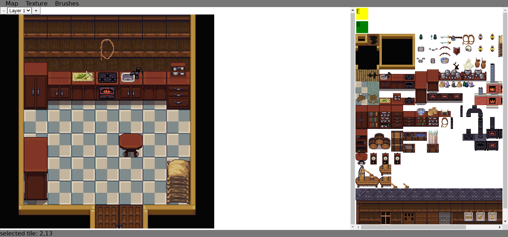

# Tile Editor

A 2D tile editor that runs on the browser.

Live version [here](https://victorribeiro.com/tileEditor/)  
Alternative link [here](https://victorqribeiro.github.io/tileEditor/)

**[How to use the tool](https://www.youtube.com/watch?v=rtw1AoJN00o)**

# About

I made this tool for personal use, but now I'm releasing it under MIT license. You can learn more about this project by watching the videos I made while working on it.

[YouTube playlist](https://www.youtube.com/playlist?list=PL3pnEx5_eGm88UxHH2OlzRRdnj7zT6Cla)

Just want to play with it? [Lots of free textures you can use](https://opengameart.org/art-search-advanced?keys=tile+map&title=&field_art_tags_tid_op=or&field_art_tags_tid=&name=&field_art_type_tid%5B%5D=9&sort_by=count&sort_order=DESC&items_per_page=24&Collection=)

# Menus

## MAP

### New
Create a new map.  
width - Width of the map (grid size)  
height - Height of the map (grid size)  
tileSize - Size of the tile you're using  
border - Border around the tile  
tileSizeDraw - Size you want your tile to be drawn  
nLayers - Number of layers on your map

### Save
Save your map as a json format.  
name - Name of the file

### Load
Load the map you saved before.  
file - JSON file to load  

### Export
Export the map as a PNG image.  
name - Name of the image to be saved  

### Expand
Expand the map size.  
top - How many rows on top to be added  
bottom - How many rows on bottom to be added
left - How many rows on left to be added
right - How many rows on right to be added

### Shrink
Shrink the map size.  
top - How many rows on top to be removed  
bottom - How many rows on bottom to be removed
left - How many rows on left to be removed
right - How many rows on right to be removed

## Texture

### Load
Load an image texture.  
image - The image file with the texture  
tileSize - The tile size of each tile  
border - Is there a border separating each tile?  

## Brushes
Create a new brush.  
custom - Create a custom brush that will be defined by you (selecting from the tiles on the texture)  
random - Create a random brush that will be defined by you (selecting from the tiles on the texture)  

## Buttons
layers - Add or remove a layer  
E - Erase brush (erase a tile from the map)  
B - Paint bucket tool (paint a whole region on the map)  

------

## Help support the project

